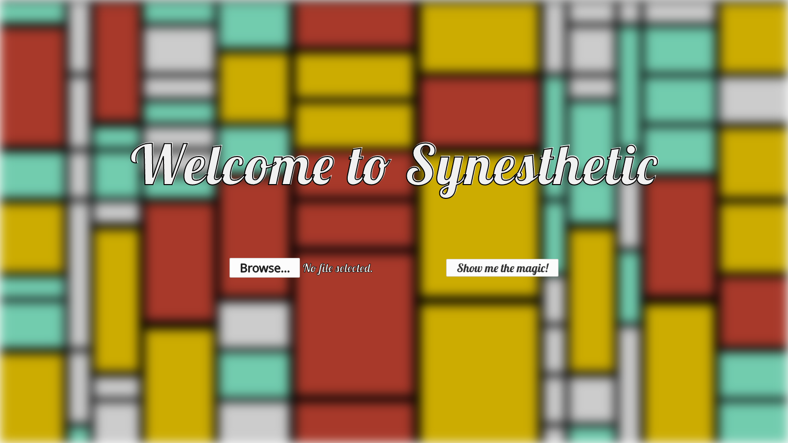
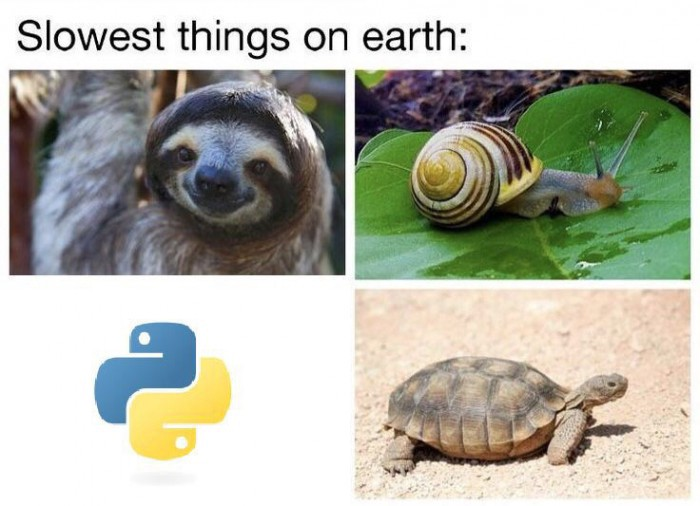

# Welcome to the source code of Synesthetic

## How do I run Synesthetic?

Clone this repository or download it manually. From a bash terminal, ```cd``` yourself inside the ```src/``` folder. Run the following command to instantiate the Flask server:

```bash
$ env FLASK_APP=flask_server.py flask run
```

The expected output is:

```bash
 * Serving Flask app "flask_server"
 * Running on http://127.0.0.1:5000/ (Press CTRL+C to quit)
 ```
 
If the server complains about missing Python dependencies, Synesthetic won't be able to start. Please install them with the 
```bash
pip3 dependency_name
```
command in order to proceed. Once the server is started, open up your browser and navigate to the IP address written in the terminal. You should be redirected to the lading page of Synesthetic:   



## How do the backend and fronted interact?

Flask is responsible for the interaction between the Python backend and the Javascript frontend. When Synesthetic starts, the user is greeted by a landing page, which requires him to upload an audio track. After the track is loaded, the rhythmic analysis is performed. The result of the rhythmic analysis is then stored into a JSON file which looks like this:

```javascript
{
    "n_windows": 2,
    "window_timings": [
        {
            "start": 0.0,
            "end": 10
        },
        {
            "start": 10.0,
            "end": 20.0
        }
    ],
    "window_content": [
        [
            {
                "BPM": 184.57,
                "offset": 0.31
            }
        ],
        [
            {
                "BPM": 191.40,
                "offset": 0.22
            },
            {
                "BPM": 53.83,
                "offset": 0.84
            }
        ]
    ]
}  
```
The rhythmic analysis is performed on non-overlapping windows of the audio track. The windows are delimited by the ```start``` and ```end``` timings, contained in the ```window_timings``` array, and are expressed in seconds. Each window has a corresponding element inside the ```window_content``` array, which contains the information about all the tempos that show up inside that window. The frequency of the tempos is expressed in BPM (beats per minute) and the offset is expressed in seconds. The offset is relative to the ```start``` value of the window. With this data structure, we're able to take into account the possibility that each window can contain a different number of tempos.


## How do you perform the rhythmic analysis?

The rhythmic analysis is based on the idea of finding the minimum number of periodicities that explain all the onsets present in the track. This analysis is performed on non-overlapping windows of the track. This way, we are able to separate the contributions of the different periodicities. The onsets are derived by applying a novelty function algorithm upon the audio track.


## Do you really need a backend? Why don't you just move everything to the frontend?

There are some key reasons that keep the backend and frontend separated.
1. **Ease of development**. Python, with its data structures, audio libraries and scientific libraris, offers so much flexibility for the development of signal processing modules. In our case, we created a module that analyzes the rhythmic properties of an audio track; therefore, it was fundamental to plot and listen to intermediate results. This enabled us to test in an appropriate way our algorithms and to create example inputs with corner cases.
2. **Scalability**. As of now, the backend performs a rhythmic analysis of the audio track thanks to the functions implemented in the module [python_modules/tempo_detection.py](python_modules/tempo_detection.py). However, in the future, other types of analysis could be performed (i.e. harmonic, melodic) in separate modules. A modular Python backend makes the project more scalable, beacause each module contains separate functionalities.
3. **Better client performance**. Music information retrieval tasks can be computationally intensive. We didn't want to penalize the user experience by making the user wait too long for the result of the audio track analysis. Therefore, the information retrieval has to be performed on the server. Another reason is that Python lets us call functions implemented in C, which enables us to remove some bottlenecks when Python runs too slow:
   
*Turtles are slow. But Python too. [Image source](https://medium.com/@trungluongquang/why-python-is-popular-despite-being-super-slow-83a8320412a9)*

That being said, it would be hypothetically possible to move everything to the frontend. That would require rewriting the Python analysis modules in JavaScript. As an alternative, there some solutions that enable Python code to be called from Javascript, but... it's very sketchy and complicated. We think that the heavy lifting has to be done on the server side.


## How does the frontend generate the representation? How are the animations triggered?

The representation is generated with the help of the p5 Javascript library.   
In the setup phase, this is what happens:
1. The audio track is loaded with the Tone.JS library
2. The JSON file is loaded with the p5 library
3. The JSON file is used in order to schedule changes in the properties of the ```RhythmicProperties``` object. These properties contain the up to date information about the rhythmic content of the piece during its playback. The scheduling of the changes is taken care by the ```Tone.Transport.schedule()``` function. The ```RhythmicProperties``` object looks something like this:
```javascript
class RhythmicProperties
{
   // Properties
   n_tempos = 0;
   tempo_isStruck =
      [
        false, false, false, false, // Array containing a boolean value for each tempo. Each element is always false,
        false, false, false, false  // except in the instant when the corresponding tempo is struck.
      ];
      
   // Methods
   ...
}
```
4. The Mondrian-like composition is generated with the help of the ```MondrianBlocks``` class   

After the setup phase, the program is ready to enter the main loop, which consists of the ```draw()``` function. The loop does the following:   
1. Check the current number of tempos 
2. Check which tempo has been struck
3. Based on the previous information, trigger an animation upon the Mondrian-like composition

## I'd like to use Synesthetic for a live concert. Can I do that?

Short answer: yes!   
Long answer: you already know that, in case of a user track, the updates of the ```RhythmicProperties``` object are scheduled in advance. If you want to use Synesthetic live, you'd have to associate the ```RhythmicProperties``` object to the rhythmic events occurring during the concert, which is constantly monitored by the ```draw()``` function.  
In order to give you an idea of what would it be like, we created a demo implementation of this feature. Follow these steps:
1. Fire up Synesthetic
2. Open up the Javascript console in your browser and type in the command ```current_rhythmic_properties.n_tempos = 4```
3. Try pressing the ```W```, ```A```, ```S``` and ```D``` keys on your keyboard. Each keypress will trigger both a drumkit sound and a corresponding animation

## I'm not really a Mondrian fan. How do I create different representation?

You can make animations of your own. You can trigger all kinds of events on the p5 canvas in response to the current number of tempos in the musical piece. To do that, you'll have to write you own functions that are called each time a tempo is struck.

## I want to know more about Flask and p5!
Then feel free to explore these examples and tutorials:
* file uploads with Flask  
link: https://blog.miguelgrinberg.com/post/handling-file-uploads-with-flask

* manage static files in Flask  
link: https://www.youtube.com/watch?v=tXpFERibRaU

* routing method for reaching elements not in static directory (which is a Flask pre-routed path)  
link: https://www.youtube.com/watch?v=Y2fMCxLz6wM&list=LL&index=1

* Animations with p5.js (metronome example)  
link: https://compform.net/animation/
